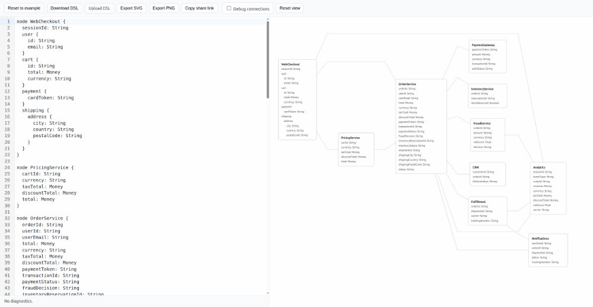

# Data Flow Visualization

Turn a few lines of DSL into an interactive data-flow diagram — in your browser.

## Demo
[Live demo](https://popovdk.github.io/data-flow/)



## Features
- Client-only (no backend required)
- Live preview with diagnostics (line/column errors)
- Field-level highlighting with full-path traversal
- Click to pin selection, click again to clear
- Zoom, pan, reset view
- Import/export DSL, export SVG/PNG
- Shareable links via URL hash
- Local persistence in `localStorage`

## DSL quick start
```text
node UserInput {
  email: String
  password: String
}

node Validator {
  rawEmail: String
  validatedEmail: String
}

node Database {
  userEmail: String
}

UserInput.email -> Validator.rawEmail
Validator.validatedEmail -> Database.userEmail
```

## DSL reference

### Nodes
Declare a node with `node <NodeId> { ... }`.
```text
node Api {
  id: String
}
```

### Optional labels
Add a custom label with `[label="..."]`.
```text
node Api [label="Public API"] {
  id: String
}
```

### Groups
Group related nodes into labeled columns. Groups are laid out left-to-right in
declaration order, and nodes inside a group are stacked vertically.
```text
group Backend [label="Backend API"] {
  node Api [label="Public API"] {
    id: String
  }
}
```

### Fields
Fields are `name: Type`.
```text
node User {
  id: String
  email: String
}
```

### Nested fields
Use braces to create nested objects. Reference them with dot paths.
```text
node Request {
  body {
    username: String
    password: String
  }
}
```
Full path example: `Request.body.username`.

### Connections
Use `SourceNode.fieldPath -> TargetNode.fieldPath`.
```text
Request.body.username -> AuthService.credentials.user
```
Direction represents data flow (left → right in layout).

### Comments
Line comments are supported:
```text
// This is a comment
# This is also a comment
```

### Identifiers
- Node IDs and field names: `[a-zA-Z_][a-zA-Z0-9_]*`
- Field paths use dot notation: `node.field.subfield`

### Types
Types are for display only. They do not change graph logic.
Allowed characters: letters, numbers, `_`, `<`, `>`, `[`, `]`.

### Whitespace
Whitespace and blank lines are ignored.

## Behavior
- Hover a field to highlight its full path
- Click a field to pin the highlight
- Click the same field again to clear
- Reverse traversal is always enabled (highlight includes upstream fields)

## Validation & diagnostics
- Duplicate node IDs or field names are errors
- Connections must reference existing nodes and field paths
- Errors include line/column and do not crash the app
- When DSL is invalid, the last valid diagram stays visible

## Architecture
- DSL core: `src/dsl` (parser, validator, AST/model + diagnostics)
- Diagram core: `src/diagram` (graph, layout, build pipeline)
- Web UI: `src/render`, `src/app`, `src/editor`, `src/shared` (renderer, controller, UI wiring)

## Example (realistic flow)
See `src/app/examples.ts` for a larger business flow example.

## Quick start
```bash
npm install
npm run dev
```

Build for production:
```bash
npm ci
npm run build
```